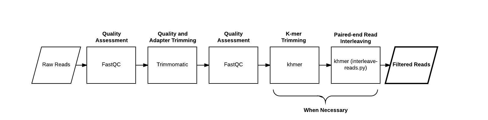
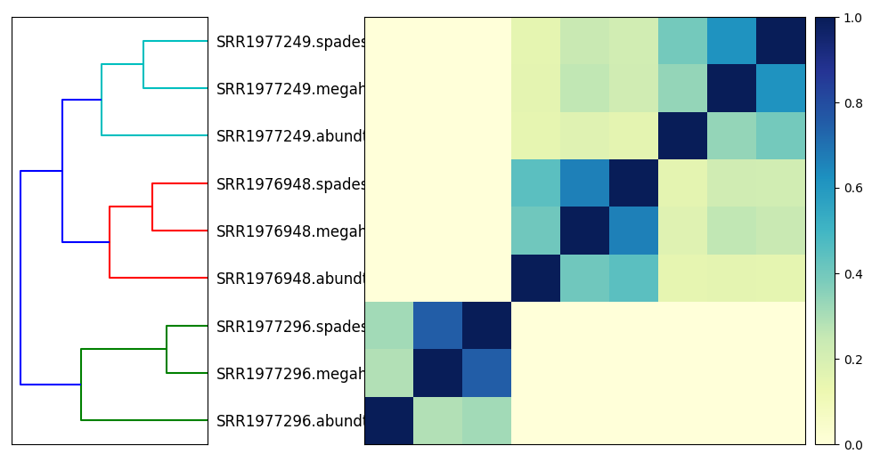

Comparing datasets using sourmash
=================================

## Using k-mers to compare samples against each other

So, one thing you can do is use k-mers to compare genomes to genomes,
or read data sets to read data sets: data sets that have a lot of similarity
probably are similar or even the same genome.

One metric you can use for this comparisons is the Jaccard distance, which
is calculated by asking how many k-mers are *shared* between two samples
vs how many k-mers in total are in the combined samples.

```
only k-mers in both samples
----------------------------
all k-mers in either or both samples
```

A Jaccard distance of 1 means the samples are identical; a Jaccard distance
of 0 means the samples are completely different.

This is a great measure and it can be used to search databases and
cluster unknown genomes and all sorts of other things!  The only real
problem with it is that there are a *lot* of k-mers in a genome --
a 5 Mbp genome (like *E. coli*) has 5 m k-mers!

About a year ago,
[Ondov et al. (2016)](https://genomebiology.biomedcentral.com/articles/10.1186/s13059-016-0997-x)
showed that
[MinHash approaches](https://en.wikipedia.org/wiki/MinHash) could be
used to estimate Jaccard distance using only a small fraction (1 in
10,000 or so) of all the k-mers.

The basic idea behind MinHash is that you pick a small subset of k-mers
to look at, and you use those as a proxy for *all* the k-mers.  The trick
is that you pick the k-mers randomly but consistently: so if a chosen
k-mer is present in two data sets of interest, it will be picked in both.
This is done using a clever trick that we can try to explain to you in
class - but either way, trust us, it works!

We have implemented a MinHash approach in our
[sourmash software](https://github.com/dib-lab/sourmash/), which can
do some nice things with samples.  We'll show you some of these things
next!

## Installing sourmash
To install sourmash, run:

```
sudo apt-get -y update && \
sudo apt-get install -y python3.5-dev python3.5-venv make \
    libc6-dev g++ zlib1g-dev
```

this installs Python 3.5.

Now, create a local software install and populate it with Jupyter and
other dependencies:

```
python3.5 -m venv ~/py3
. ~/py3/bin/activate
pip install -U pip
pip install -U Cython
pip install -U jupyter jupyter_client ipython pandas matplotlib scipy scikit-learn khmer

pip install -U https://github.com/dib-lab/sourmash/archive/master.zip
```

## Generate a signature for Illumina reads

Download some reads and the assembled metagenome:

```
cd ~/work
curl -O -L https://s3-us-west-1.amazonaws.com/dib-training.ucdavis.edu/metagenomics-scripps-2016-10-12/SRR1976948.abundtrim.subset.pe.fq.gz
curl -L -o SRR1976948.megahit.abundtrim.subset.pe.assembly.fa https://files.osf.io/v1/resources/b5feu/providers/osfstorage/59c8baca9ad5a10260b5fe1f?action=download&version=1&direct
curl -L -o SRR1976948.spades.abundtrim.subset.pe.assembly.fa https://files.osf.io/v1/resources/b5feu/providers/osfstorage/59c8bad9b83f69025c69de43?action=download&version=1&direct
```

Compute a scaled MinHash signature from our reads:



```
mkdir ~/sourmash
cd ~/sourmash
```

First let's compute a signature for some reads from the `Hu et al.,
2016 <http://mbio.asm.org/content/7/1/e01669-15.full>`__. paper. These reads 
have been quality trimmed but not khmer trimmed. In practice it may be important 
to compare outcomes with and with kmer trimming. 
```
sourmash compute -k51 --scaled 10000 SRR1976948.abundtrim.subset.pe.fq.gz -o SRR1976948.reads.scaled10k.k51.sig 
```

## Compare reads to assemblies

Use case: how much of the read content is contained in our assembled metagenome?

Build a signature for an assembled metagenome:

```
sourmash compute -k51 --scaled 10000 SRR1976948.spades.abundtrim.subset.pe.assembly.fa -o SRR1976948.spades.scaled10k.k51.sig 
sourmash compute -k51 --scaled 10000 SRR1976948.megahit.abundtrim.subset.pe.assembly.fa -o SRR1976948.megahit.scaled10k.k51.sig
```

and now evaluate *containment*, that is, what fraction of the read content is
contained in the genome:


```
sourmash search -k 51 SRR1976948.reads.scaled10k.k51.sig SRR1976948.megahit.scaled10k.k51.sig --containment 
sourmash search -k 51 SRR1976948.reads.scaled10k.k51.sig SRR1976948.spades.scaled10k.k51.sig --containment
```
You should see something like: 
```
loaded query: SRR1976948.abundtrim.subset.pe... (k=51, DNA)
loaded 1 signatures and 0 databases total.                                     
1 matches:
similarity   match
----------   -----
 48.7%       SRR1976948.megahit.abundtrim.subset.pe.assembly.fa

loaded query: SRR1976948.abundtrim.subset.pe... (k=51, DNA)
loaded 1 signatures and 0 databases total.                                     
1 matches:
similarity   match
----------   -----
 47.5%       SRR1976948.spades.abundtrim.subset.pe.assembly.fa
```
Why are only ~40% of our reads in the genome?

Try the reverse - why is it bigger?

```
sourmash search -k 51 SRR1976948.megahit.scaled10k.k51.sig SRR1976948.reads.scaled10k.k51.sig --containment
sourmash search -k 51 SRR1976948.spades.scaled10k.k51.sig SRR1976948.reads.scaled10k.k51.sig  --containment
```
```
loaded query: SRR1976948.megahit.abundtrim.s... (k=51, DNA)
loaded 1 signatures and 0 databases total.                                     
1 matches:
similarity   match
----------   -----
 99.8%       SRR1976948.abundtrim.subset.pe.fq.gz

loaded query: SRR1976948.spades.abundtrim.su... (k=51, DNA)
loaded 1 signatures and 0 databases total.                                     
1 matches:
similarity   match
----------   -----
 99.9%       SRR1976948.abundtrim.subset.pe.fq.gz
 ```
(...but ~ 99% of our k-mers from the genome are in the reads!?)

This is basically because of sequencing error! Illumina data contains
a lot of errors, and the assembler doesn't include them in the assembly!

## Compare signatures.

First, to make our comparison more interesting let's grab some signatures for the other datasets and assemblies for this study 
```
curl -L -o SRR1977249.reads.scaled10k.k51.sig https://files.osf.io/v1/resources/b5feu/providers/osfstorage/59c876c0594d900251ea7a6b?action=download&version=1&direct
curl -L -o SRR1977296.reads.scaled10k.k51.sig https://files.osf.io/v1/resources/b5feu/providers/osfstorage/59c876e19ad5a10260b5e394?action=download&version=1&direct
curl -L -o SRR1977249.megahit.scaled10k.k51.sig https://files.osf.io/v1/resources/b5feu/providers/osfstorage/59c876b6594d900251ea7a68?action=download&version=1&direct
curl -L -o SRR1977249.spades.scaled10k.k51.sig https://files.osf.io/v1/resources/b5feu/providers/osfstorage/59c876cab83f69025a698a51?action=download&version=1&direct
curl -L -o SRR1977296.megahit.scaled10k.k51.sig https://files.osf.io/v1/resources/b5feu/providers/osfstorage/59c876d56c613b025ae27d47?action=download&version=1&direct
curl -L -o SRR1977296.spades.scaled10k.k51.sig https://files.osf.io/v1/resources/b5feu/providers/osfstorage/59c876ecb83f69025c69cb9f?action=download&version=1&direct
```
Now, let's compare these signatures and plot their jaccard similarities
 
Adjust plotting (this is a bug in sourmash :) --

Compare all the signatures:


```
sourmash compare *sig -o Hu_metagenomes
```

and then plot:

```
sourmash plot --labels Hu_metagenomes
```

which will produce a file `Hu_metagenomes.dendro.png` and `Hu_metagenomes.matrix.png`
which you can then download via FileZilla and view on your local computer.

Now open jupyter notebook and visualize:

```
from IPython.display import Image
Image("Hu_metagenomes.matrix.png")
```

Here's a PNG version:



What can we do now? 
- More k-mer exploration 
- Taxonomic classfication 
- Functional analysis 

